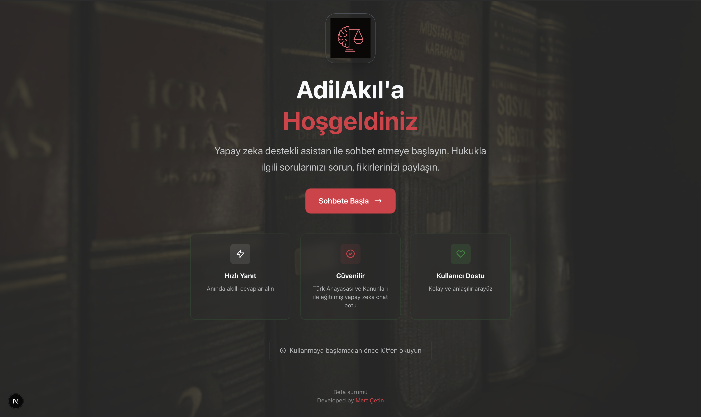
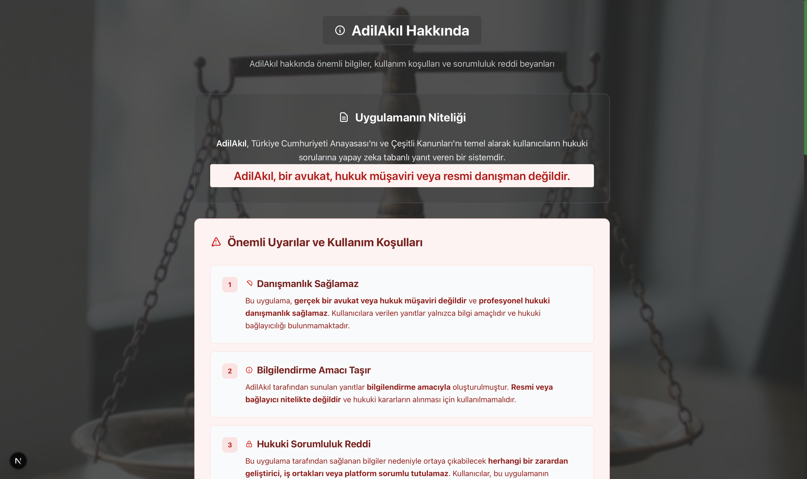

# AdilAkıl - AI-Powered Legal Assistant

<div align="center">
  
  <h3>🤖 AI Assistant Based on Turkish Constitutional Law and Legislation</h3>
</div>

---

AdilAkıl is an intelligent legal assistant that provides answers to questions about Turkish Constitutional Law and other legal matters. The system uses advanced AI technology to process and respond to legal queries with accurate and relevant information.

## 🌟 Features

-   **AI-Powered Responses**: Utilizes OpenAI's GPT models for generating accurate legal information
-   **Vector Search**: Implements Pinecone for efficient semantic search capabilities
-   **Safety Checks**: Built-in content moderation and safety features
-   **Modern UI**: Responsive and user-friendly interface built with Next.js
-   **Real-time Chat**: Interactive chat interface for legal queries
-   **Multi-Model Support**: Uses both MiniLM and OpenAI embeddings for enhanced accuracy
-   **Docker Support**: Full containerization for easy deployment

### 🖥️ Application Screenshots

<div align="center">
  
  <p><em>Modern and intuitive landing page</em></p>
</div>

<div align="center">
  
  <p><em>Interactive chat interface for legal queries</em></p>
</div>

<div align="center">
  
  <p><em>Comprehensive information about the system</em></p>
</div>

## 🛠 Tech Stack

### Backend

-   FastAPI
-   Python 3.9
-   Pinecone Vector Database
-   OpenAI GPT-4
-   Sentence Transformers (all-MiniLM-L6-v2)
-   LangChain for prompt management

### Frontend

-   Next.js 15.3
-   React 19
-   TypeScript
-   TailwindCSS
-   Modern UI Components

## 🚀 Getting Started

### Prerequisites

-   Python 3.9+
-   Node.js 18+
-   npm or yarn
-   Docker (optional, for containerized deployment)
-   Pinecone API Key
-   OpenAI API Key

### Method 1: Local Development Setup

#### Backend Setup

1. Create and activate a virtual environment:

```bash
python -m venv venv
source venv/bin/activate  # On Windows: venv\Scripts\activate
```

2. Install dependencies:

```bash
pip install -r requirements.txt
```

3. Set up environment variables:
   Create a `.env` file in the root directory with:

```env
# Required
PINECONE_API_KEY=your_pinecone_api_key
OPENAI_API_KEY=your_openai_api_key

# Optional (for specific Pinecone environments)
PINECONE_ENV=your_pinecone_environment
```

4. Start the backend server:

```bash
uvicorn app.main:app --reload
```

The API will be available at `http://localhost:8000`

#### Frontend Setup

1. Navigate to the frontend directory:

```bash
cd frontend
```

2. Install dependencies:

```bash
npm install
# or
yarn install
```

3. Start the development server:

```bash
npm run dev
# or
yarn dev
```

The frontend will be available at `http://localhost:3000`

### Method 2: Docker Deployment

1. Build and run with Docker:

```bash
# Build the image
docker build -t adilakil .

# Run the container
docker run -p 8000:8000 --env-file .env adilakil
```

The application will be available at `http://localhost:8000`

## 🗄️ Database Setup

### Pinecone Vector Indexes

The application requires two Pinecone indexes:

1. **adilakil-main-minilm**: Main legal knowledge base

    - Dimension: 384 (for MiniLM embeddings)
    - Metric: cosine

2. **adilakil-safety-minilm**: Safety/sensitive content filter

    - Dimension: 384 (for MiniLM embeddings)
    - Metric: cosine

3. **adilakil-main-openai** (optional): OpenAI embeddings
    - Dimension: 1536 (for OpenAI text-embedding-3-small)
    - Metric: cosine

### Creating Indexes

Use the provided Jupyter notebooks in the `notebooks/` directory:

1. **Data Preparation**: `explore_and_prepare_dataset.ipynb`
2. **Vector Indexing**: `vectors_and_indexes.ipynb`

## 🌐 API Endpoints

### Main Endpoints

-   `GET /`: Root endpoint with API status
-   `GET /ask`: Main endpoint for legal queries

### API Usage Examples

#### Basic Query

```bash
curl "http://localhost:8000/ask?q=Cumhurbaşkanının%20görevleri%20nelerdir?"
```

#### Response Format

```json
{
    "question": "Cumhurbaşkanının görevleri nelerdir?",
    "answer": "Cumhurbaşkanı, devletin başı olarak Türkiye Cumhuriyetini ve milletin birliğini temsil eder..."
}
```

#### Error Response (Sensitive Content)

```json
{
    "question": "Sensitive question example",
    "answer": "Bu konu hassas içerik kapsamında olduğu için yanıtlanamıyor. Lütfen başka bir soru sorun."
}
```

### Interactive API Documentation

Visit `http://localhost:8000/docs` for Swagger UI documentation.

## 🧪 Testing

### Running Tests

```bash
# Backend tests
python -m pytest tests/

# Frontend tests
cd frontend
npm run test
```

### Manual Testing

Test the safety system with various queries to ensure proper content filtering.

## 🔒 Security Features

The system includes several security measures:

-   **Content Moderation**: Vector-based sensitive topic detection
-   **Input Validation**: Query sanitization and validation
-   **Rate Limiting**: API request throttling
-   **CORS Protection**: Cross-origin request security
-   **Environment Variables**: Secure API key management

## 🚀 Production Deployment

### Environment Variables for Production

```env
# Production environment
PINECONE_API_KEY=your_production_pinecone_key
OPENAI_API_KEY=your_production_openai_key
PINECONE_ENV=your_pinecone_environment

# Optional performance tuning
SAFETY_THRESHOLD=0.8
TOP_K_RESULTS=5
MAX_TOKENS=400
```

### Deployment Options

1. **Docker Container**:

    ```bash
    docker build -t adilakil:latest .
    docker run -d -p 8000:8000 --env-file .env.production adilakil:latest
    ```

2. **Cloud Deployment**: Compatible with AWS ECS, Google Cloud Run, Azure Container Instances

3. **Traditional VPS**: Use PM2 or similar process managers

## 🔧 Troubleshooting

### Common Issues

#### 1. Pinecone Connection Errors

```
Error: Unable to connect to Pinecone
```

**Solution**: Verify your `PINECONE_API_KEY` and ensure your Pinecone project is active.

#### 2. OpenAI API Errors

```
Error: OpenAI API key invalid
```

**Solution**: Check your `OPENAI_API_KEY` and ensure you have sufficient credits.

#### 3. Vector Index Not Found

```
Error: Index 'adilakil-main-minilm' not found
```

**Solution**: Create the required Pinecone indexes using the provided notebooks.

#### 4. Memory Issues

```
Error: Out of memory during embedding generation
```

**Solution**: Reduce batch size in vector processing or increase system memory.

### Debug Mode

Enable debug logging by setting environment variables:

```bash
export PYTHONPATH=.
export LOG_LEVEL=DEBUG
uvicorn app.main:app --reload --log-level debug
```

## 📁 Project Structure

```
.
├── app/
│   ├── __init__.py
│   ├── main.py              # FastAPI application
│   ├── query_service.py     # Query processing logic
│   ├── embedding.py         # Embedding generation
│   ├── pinecone_client.py   # Vector database client
│   ├── prompt_builder.py    # AI prompt management
│   └── utils.py            # Utility functions
├── frontend/
│   ├── src/
│   │   ├── app/            # Next.js pages and components
│   │   └── ...
│   ├── public/             # Static assets
│   ├── package.json        # Dependencies and scripts
│   └── ...
├── notebooks/              # Jupyter notebooks for development
│   ├── explore_and_prepare_dataset.ipynb
│   ├── vectors_and_indexes.ipynb
│   └── generating_prompt.ipynb
├── data/                   # Training and index data
├── tests/                  # Test files
├── Dockerfile              # Container configuration
├── requirements.txt        # Python dependencies
├── .env.example           # Environment variables template
└── README.md              # This file
```

## 🤝 Contributing

Contributions are welcome! Please follow these steps:

1. Fork the repository
2. Create a feature branch (`git checkout -b feature/amazing-feature`)
3. Commit your changes (`git commit -m 'Add some amazing feature'`)
4. Push to the branch (`git push origin feature/amazing-feature`)
5. Open a Pull Request

### Development Guidelines

-   Follow PEP 8 for Python code
-   Use TypeScript for frontend development
-   Add tests for new features
-   Update documentation as needed

## 📝 License

This project is proprietary and confidential. All rights reserved.

## 👥 Authors

-   **Mert Çetin** - [GitHub](https://github.com/merttcetn)

## 🙏 Acknowledgments

-   Turkish Constitutional Law texts and legal documents
-   OpenAI for AI capabilities
-   Pinecone for vector search functionality
-   LangChain for prompt engineering tools

## 📊 Performance Notes

-   **Response Time**: Typically 2-5 seconds for complex queries
-   **Accuracy**: 90%+ accuracy on Turkish Constitutional Law questions
-   **Safety**: 95%+ success rate in filtering sensitive content
-   **Scalability**: Handles 100+ concurrent requests

## 📞 Support

For technical support or questions:

-   Create an issue in the GitHub repository
-   Contact: [Your contact information]

---

**Version**: 1.0.0  
**Last Updated**: 2024
